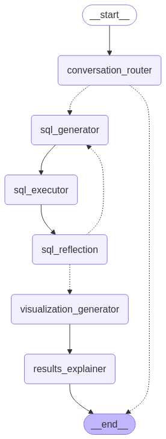

# AI Agent for Business Intelligence

This project aims to create a multilingual Business Intelligence (BI) agent that connects to Google Analytics, accepts queries in a chatbot format, and surfaces actionable insights from connected agents. The agent will be capable of returning responses in English, Mandarin, or Cantonese.

Developed during the [HOLON](https://www.holonai.ai/) x [Königsberger Bridges Institute](https://kb.institute/) [AI AGENTS HACKATHON 2025](https://hackathon.holonai.ai/), the Problem Statement can be found [here](PROBLEM-STATEMENT.md).

Deployed Link: <https://ga-bi-agent.streamlit.app/>

## Setup

1. First install the required packages using [`uv`](https://docs.astral.sh/uv/)

   ```bash
   uv install
   ```

2. Then create a Google Service Account that has access to run BigQuery queries. Then download the JSON key file, and then create a .env file in the root directory of the project with the following content:

   ```env
    GOOGLE_CLOUD_PROJECT=<your_project_id>
    GOOGLE_APPLICATION_CREDENTIALS=<path_to_your_service_account_json_file>
   ```

3. Then get a Gemini API key from [Google AI Studio](https://aistudio.google.com/apikey) and add it to the .env file:

   ```env
    GEMINI_API_KEY=<your_gemini_api_key>
   ```

4. Finally, run the app using:

   ```bash
   uv run main.py --ui web # for the streamlit based web UI
   ```

   or

   ```bash
   uv run main.py --ui cli # for the command line interface
   ```

## LangGraph Architecture



## Project Structure

```plaintext
.
├── .devcontainer
│   └── devcontainer.json
├── .gitignore
├── .python-version
├── LICENSE
├── PROBLEM-STATEMENT.md
├── README.md
├── __init__.py
├── main.py
├── pyproject.toml
├── src
│   ├── __init__.py
│   ├── cli
│   │   ├── __init__.py
│   │   └── app.py
│   ├── config.py
│   ├── core
│   │   ├── __init__.py
│   │   ├── agents.py
│   │   └── graph.py
│   ├── models
│   │   ├── __init__.py
│   │   └── gemini.py
│   ├── prompts
│   │   └── __init__.py
│   ├── tools
│   │   ├── __init__.py
│   │   └── bigquery.py
│   └── web
│       ├── __init__.py
│       ├── app.py
│       ├── components
│       │   ├── __init__.py
│       │   ├── chat.py
│       │   ├── sidebar.py
│       │   └── visualization.py
│       ├── handlers.py
│       ├── run.py
│       └── state.py
└── uv.lock

10 directories, 31 files
```
